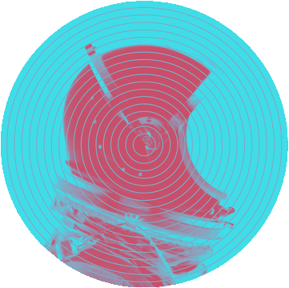

<!-- HEADER -->
<br />
<p align="center">
 <a href="https://github.com/Deathmajorasmask/Space-Bomb">
    
 </a>

  <h3 align="center">Space Bomb</h3>

  <p align="center">
    An awesome video game created in three.js !
    <br />
  </p>
</p>

<!-- TABLE OF CONTENTS -->
<details open="open">
  <summary>Table of Contents</summary>
  <ol>
    <li>
      <a href="#about-the-project">About The Project</a>
      <ul>
        <li><a href="#built-with">Built With</a></li>
      </ul>
    </li>
    <li>
      <a href="#getting-started">Getting Started</a>
      <ul>
        <li><a href="#prerequisites">Prerequisites</a></li>
        <li><a href="#installation">Installation</a></li>
      </ul>
    </li>
    <li><a href="#screenshots">Screenshots</a></li>
    <li><a href="#roadmap">Roadmap</a></li>
    <li><a href="#contributing">Contributing</a></li>
    <li><a href="#license">License</a></li>
    <li><a href="#contact">Contact</a></li>
  </ol>
</details>


<!-- ABOUT THE PROJECT -->
## About The Project

[![Product Name Screen Shot][screenshot]](https://github.com/Deathmajorasmask/Space-Bomb)

It's a game inspired by Hudson Soft's Bomberman, developed in Three.js.

The software contains collisions, exporter / importer of objs, textures and mtls, full gameplay, ability to share scores, handling of sounds and music within each game, multiplayer maps, and the facility to develop new levels.

The possibilities with this base are endless, so I hope you can take the source code of this project as an example.

### Built With

This project uses some external libraries, I list them below:
* [three.js](https://threejs.org/)
* [JQuery v2.1](https://jquery.com/)
* [OBJ/MTLLoader](https://github.com/angelxuanchang/three.js)


<!-- GETTING STARTED -->
## Getting Started

Follow the instructions below to get it working and proceed to modify or test this project.

### Prerequisites

You will have to download.
* XAMPP, WAMPP, MAMP or other server compatible with Apache


### Installation

1. Clone the repo
   ```sh
   git clone https://github.com/Deathmajorasmask/Space-Bomb.git
   ```
2. Move Space Bomb files to hdocs.

3. Press 'Start' in XAMPP to Apache.

4. Open Space-Bomb in Chrome, Firefox or Opera.
   ```sh
   http://localhost/
   ```


## Screenshots
![Product Name Screen Shot][screenshot01]
![Product Name Screen Shot][screenshot02]
![Product Name Screen Shot][screenshot03]


<!-- ROADMAP -->
## Roadmap

See the [open issues](https://github.com/Deathmajorasmask/Space-Bomb/issues) for a list of proposed features (and known issues).


<!-- CONTRIBUTING -->
## Contributing

Contributions are what make the open source community such an amazing place to learn, inspire, and create. Any contributions you make are **greatly appreciated**.

1. Fork the Project
2. Create your Feature Branch (`git checkout -b feature/AmazingFeature`)
3. Commit your Changes (`git commit -m 'Add some AmazingFeature'`)
4. Push to the Branch (`git push origin feature/AmazingFeature`)
5. Open a Pull Request


<!-- LICENSE -->
## License

Distributed under the MIT License. See `LICENSE` for more information.


<!-- CONTACT -->
## Contact

Deathmajorasmask - zijaham_link@hotmail.com

Project Link: [https://github.com/Deathmajorasmask/Space-Bomb](https://github.com/Deathmajorasmask/Space-Bomb)


<!-- MARKDOWN LINKS & IMAGES -->
[screenshot]: images/Game_SpaceBomb.JPG
[screenshot01]: images/GameMultiplayer04_SpaceBomb.JPG
[screenshot02]: images/Game04_SpaceBomb.JPG
[screenshot03]: images/Menu_SpaceBomb.JPG